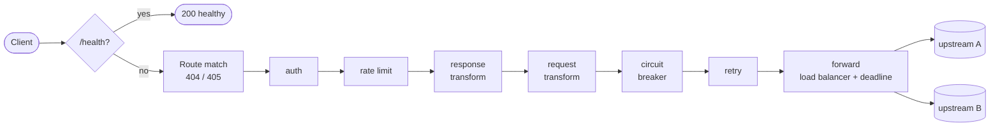

# GatewayKit

**A lightweight, config-driven API gateway, built from scratch on Node.js.**

[](https://github.com/trouta23/gatewaykit/actions/workflows/ci.yml)

Point it at a `gateway.yaml` and it routes, authenticates, rate-limits, load-balances and protects traffic to your upstream services. There are no frameworks: the HTTP server and client are Node's standard library, and the only runtime dependency is a YAML parser.

**Status:** v0.1. Runs as a single instance with in-memory state, so rate limits and breaker state reset on restart. Body transforms aren't built yet (see the [roadmap](#roadmap)).

---

## Features

- **Config-driven routing.** Longest-prefix matching on path segments, method filtering (405 with `Allow`), and optional `strip_prefix`.
- **Fail-fast config.** Every problem is reported at startup with its YAML path. Unknown keys are rejected, so a typo can't silently disable a policy.
- **API-key auth.** Constant-time comparison, and credentials are never forwarded upstream.
- **Rate limiting.** Fixed or sliding window, per client IP or per route. Exact under concurrency.
- **Load balancing.** Round robin, or smooth weighted round robin (nginx's algorithm).
- **Resilience.** A request deadline enforced end to end, retries with backoff (idempotent methods only), a circuit breaker with half-open probing, and active health checks.
- **Header transforms.** Add or remove request and response headers, with dynamic values.
- **Safe proxying.** Request-smuggling-resistant body framing, hop-by-hop header hygiene, dot-segment normalization, and client-abort cancellation.
- **Graceful shutdown.** In-flight requests drain on SIGTERM, with a hard cap.
- **Built to extend.** Each config feature is a single middleware file plugged into an ordered pipeline.

See the [feature checklist](#feature-checklist) for exactly what's implemented.

## Quick start

Requires **Node.js 24+**, which runs TypeScript directly, so there's no build step.

```bash
npm ci
npm run mock    # terminal 1: mock upstreams on :3001-3006
npm start       # terminal 2: gateway on :8080, using config/gateway.yaml
```

The example config's `/api/legacy` route uses body transforms, which aren't built yet, so expect two startup warnings saying they're ignored.

To only *run* the gateway, `npm ci --omit=dev` is enough: it installs exactly one package (`yaml`). Tests and typechecking need the dev dependencies (`typescript`, `@types/node`), so use plain `npm ci` for those.

```bash
curl -i localhost:8080/health                                      # {"status":"healthy","uptime_seconds":3}
curl -i localhost:8080/api/users/42                                # proxied to :3001
curl -i localhost:8080/api/products/123                            # strip_prefix → upstream sees /123
curl -i -X POST localhost:8080/api/products                        # 405, Allow: GET
curl -i localhost:8080/api/internal                                # 401 (api_key required)
curl -i -H 'X-API-Key: sk_live_abc123' localhost:8080/api/internal # 200
```

The config path comes from the first argument (`npm start -- other.yaml`), then the `GATEWAY_CONFIG` environment variable, then `config/gateway.yaml` (so a bare `npm start` runs the example). An invalid config never starts:

```
$ node src/main.ts broken.yaml
Invalid gateway config:
  - gateway.port: must be an integer between 1 and 65535
  - routes[0].auht: unknown key
  - routes[1].upstream: must define exactly one of "url" or "targets"
```

## How it works

Each route compiles once at startup into a single handler: an ordered chain of middleware wrapped around the upstream forwarder.



```ts
type Handler    = (req: GatewayRequest) => Promise<GatewayResponse>;
type Middleware = (next: Handler) => Handler;
```

A feature can reject a request (auth, rate limit, an open breaker), call `next` again (retry), or map the response (transforms), and it never touches a socket. Adding a config feature takes a validator entry, one plugin file in [`src/plugins/`](src/plugins), and one line in the ordered [registry](src/plugins/index.ts). The *why* behind the order and the architecture is in [DECISIONS.md](DECISIONS.md).

## Feature checklist

| Config key / endpoint | Status | Behavior |
|---|---|---|
| `gateway.port` | ✅ | Defaults to 8080 |
| `GET /health` | ✅ | Reserved, answered before routing: `{"status":"healthy","uptime_seconds":N}` |
| `routes[].path`, `methods` | ✅ | Longest segment-boundary prefix; 404 / 405 + `Allow` |
| `routes[].strip_prefix` | ✅ | `/api/products/123` → `/123`; the query string is kept byte-for-byte |
| `global_timeout`, `upstream.timeout` | ✅ | One deadline per request. Expiry before upstream headers → 504; expiry while the body streams → the connection is cut (the status is already sent); unreachable upstream → 502 |
| `auth` (`api_key`) | ✅ | 401 without a valid key; the key header is stripped before forwarding |
| `global_rate_limit`, `rate_limit` | ✅ | `fixed_window` / `sliding_window`, `per: ip` / `global`; a route's `rate_limit` replaces the global default (they don't stack); 429 + `Retry-After` |
| `upstream.targets`, `balance` | ✅ | `round_robin`, smooth `weighted_round_robin` |
| `circuit_breaker` | ✅ | Trips after `threshold` failures in `window`; 503 `{"error":"service_unavailable","retry_after":N}`; one probe after `cooldown` |
| `retry` | ✅ | Idempotent methods only (never POST); fixed or exponential backoff inside the request deadline. To replay them, retry-eligible request bodies are buffered (max 10 MiB → 413); a stalled upload → 408 |
| `health_check` | ✅ | Active GET probes; unhealthy after `unhealthy_threshold` failures; fails open if every target is down |
| `request_transform.headers`, `response_transform.headers` | ✅ | `add` / `remove`, `$request_time`, `$response_time`, `$route_path`, `$literal:`; connection and framing headers are protected. Response transforms apply to upstream responses only, not to gateway-generated errors (401, 429, 502, …) |
| `request_transform.body.mapping`, `response_transform.body.envelope` | ❌ | Validated at startup, but not applied (startup warning) |

Body transforms are the only config keys without an implementation. They log a startup warning and are skipped. A security feature is never skipped that way: an unimplemented `auth` would **fail closed** (503) instead.

## Testing

```bash
npm test
```

This typechecks with `tsc --noEmit`, then runs the suite with `node --test`:

- **Unit tests** per feature. Plugins are tested with a fake `next` and an injected clock, so nothing sleeps.
- **Integration tests** boot the real gateway and mock upstreams on ephemeral ports, with configs deliberately different from `config/gateway.yaml`. They include the 50-concurrent-requests rate-limit case and request-smuggling regressions.

The mock upstream ([`mock/upstream.ts`](mock/upstream.ts)) echoes every request back as JSON, and has `…/status/:code`, `…/slow?ms=N`, `…/flaky?fail=N` and `/healthz` for failure scenarios.

## Manual QA

```bash
npm run qa                     # every scenario
npm run qa -- rate-limit       # one scenario
```

Each scenario in [`scripts/qa/`](scripts/qa) spawns the real `node src/main.ts` process against mock upstreams and prints what happened, for example `50 concurrent vs limit 10 → 200 x10, 429 x40; upstream saw 10`. This is the same evidence posted on every PR, so anyone can re-run it.

## Project layout

```
src/main.ts            entry point: config path, startup, graceful shutdown
src/config/            YAML loading, validation, normalized types
src/server.ts          HTTP server: /health, routing, 404/405, error rendering
src/router.ts          longest-prefix route matching on path segments
src/pipeline.ts        Handler / Middleware / Plugin contracts
src/plugins/           one file per config feature, plus the ordered registry
src/proxy/             upstream forwarding: deadline, body framing, header hygiene
src/upstream/          target selection: load balancing and health checks
mock/upstream.ts       mock upstream for tests and demos
scripts/qa/            manual QA scenarios against the real process (npm run qa)
test/                  node:test suites
docs/                  the plan, the two independent AI plans it reconciled, the AI workflow and its prompts
```

## How this was built

GatewayKit was built in a two-hour, AI-assisted window. Two AI planners (Claude and Codex) drafted the architecture independently, and the plans were reconciled in [docs/PLAN.md](docs/PLAN.md). Every PR then got an independent Codex review plus manual QA before merging. [DECISIONS.md](DECISIONS.md) covers the prioritization, the trade-offs, and what Codex caught, including a request-smuggling bug.

## Roadmap

Shared state for multi-instance deployments, passive health checks, hot config reload, retry jitter, metrics, and body transforms. Details are in [DECISIONS.md](DECISIONS.md#6-built-partial-and-next).
