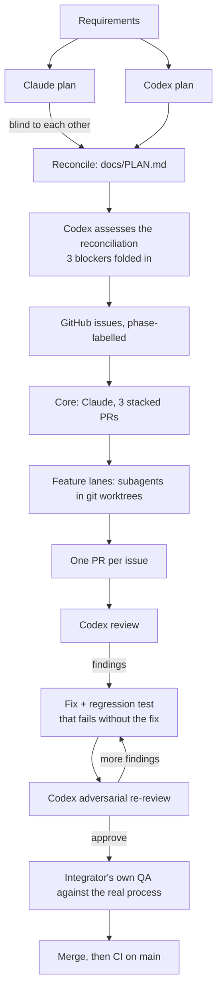

# How AI tools were used

The PR trail on GitHub is the log: every plan, review, fix and QA run is there. What it can't show is the *inputs*: the setup the agents ran inside, and the prompts that steered them. This page covers both.

## The harness: more than `AGENTS.md`

[`AGENTS.md`](../AGENTS.md) in this repo is only the per-repository review rules that Codex reads. The agents actually ran inside a personal setup I've refined over months and use across all my projects. It isn't committed, because it's cross-project and personal, but it shaped every decision here, so here is what's in it.

**A standing operating manual**, loaded into every session:
- **A priority order for conflicts:** correctness > security > user intent > clarity > simplicity > performance.
- **Verify, don't assume.** Read before editing, run before claiming, and "every number traces to a computation": no figure in a summary unless a tool produced it in this session. (That rule is why a PR body claiming "142 tests pass" was caught and the suite was run *before* the claim stood.)
- **Research before asking.** Questions go to the human only at genuine forks: one-way doors, scope ambiguity, or values calls.
- **Mechanize over judgment.** Reviews and checklists enumerate fixed targets ("for each finding: fixed, or answered with a reason") instead of "look for problems".
- **Research currency.** Date every external claim and search newest-first. The PR template was rewritten from 2026 evidence, not habit.
- **Named bias corrections** I can trigger mid-session with one word: "opinion" (stop offering menus), "deeper" (you stopped too early), "first principles", "be honest", "goal check", and others.
- **Subagent discipline.** Research agents write to files and return short summaries; work in flight is capped.

**Skills** (packaged, versioned workflows):
- *Brainstorming*: classify the request (spike, bounded or architectural), write back an understanding, and get approval before any code. That's why this project started with two independent plans instead of code.
- *The Codex plugin*: `task` for independent planning, `review` for every PR, and `adversarial-review` for re-reviews after fixes.

**Hooks** that changed behavior in visible ways:
- A context-protection hook routes bulky command output to a sandbox and blocks inline `curl` and `fetch`. Manual QA therefore moved into script files, which became [`npm run qa`](../scripts/qa).
- A token-saving CLI proxy compresses command output. It once hid merge commits from `git log`, and a check of the raw history confirmed they were there.

**Models:** Claude (Opus 5.5) orchestrated, implemented the core, and ran parallel implementation subagents. Codex (gpt-6-astra at `xhigh` reasoning effort) planned independently and reviewed every PR. A lighter model handled one web-research task (the PR template evidence).

## The workflow

## What the human decided

The agents proposed; these calls were mine, made in the moment:
- Remove time estimates from issues; prioritize by impact and blockage ("phases").
- Track every change as issue → branch → PR, with a PR template, later rewritten from evidence.
- **PR size discipline.** The first core PR (~1,900 lines, five concerns) was closed and split into a three-PR stack.
- **"Make sure our base is solid before we keep shotgunning."** Paused the feature lanes until the core was merged.
- **A parallelism cap.** At most 1–3 work streams in flight, after fan-out outran review quality.
- **A merge gate:** fresh-eyes review *and* the integrator's own manual QA on every PR, kept in one updated comment.
- No decorative badges: earn one with real CI. Publish the QA scripts instead of keeping them local.
- Move the cut line from 15:20 to 15:30. File honest follow-up issues for what's left.

## What review caught

Every finding was either fixed with a regression test (confirmed to fail without the fix) or answered with a reason and a follow-up issue.

| PR | Findings |
|---|---|
| #13 config | 5 × P2 (header syntax, unsafe mapping paths, envelope lists, cyclic YAML aliases, empty literals), 1 × P3 |
| #15 core proxy | **P1 request smuggling** (chunked GET), 2 × P2; adversarial re-review: **P1, a second smuggling path** via `Connection: content-length`; then an upload/deadline leak, fixed in #22 |
| #17 auth | **P1 credential leak** via `X-Request-Id`; P2 duplicate `Authorization` (accepted → #36) |
| #20 circuit breaker | P2: stale in-flight results re-opening a recovered circuit |
| #21 health checks | 2 × P2 (fetch "bad ports", query encoding); then a 101 response freezing probes; then the target query dropped |
| #23 header transforms | 2 × P2, 1 × P3; then 2 × P2 (forged `X-Forwarded-Host`, `__proto__` headers) |
| #24 retry | **P1** stalled uploads ignoring the deadline; then P2 (that 504 tripping the breaker → 408); then P2 (the deadline-boundary race) |
| #27 docs | 4 accuracy findings in the docs; then an upstream-101 client hang in the core, fixed in #40 |
| #14, #18, #19, #22, #25, #26 | No findings |

## The prompts, verbatim

- [`prompts/codex-planning.md`](prompts/codex-planning.md): the prompt that had Codex plan independently (the requirements text is elided).
- [`prompts/lane-brief.md`](prompts/lane-brief.md): the brief every implementation subagent received. Each task message then added the issue's specifics and overrides.
- **Reviews** were `codex review --base origin/main` per PR. Re-reviews were `codex adversarial-review` with a focus line naming the fixed findings, plus *"try to break it again… flag only P0/P1 or an unfixed P2."*
