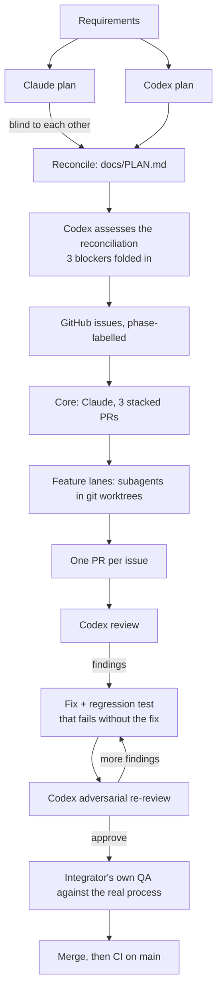

# How AI tools were used

The PR trail on GitHub is the log: every plan, review, fix and QA run is there. What it can't show is the *inputs*: the setup the agents ran inside, and the prompts that steered them. This page covers both.

## The harness: more than `AGENTS.md`

[`AGENTS.md`](../AGENTS.md) in this repo is only the per-repository review rules that Codex reads. The agents actually ran inside a personal setup I've refined over months and use across all my projects. It isn't committed, because it's cross-project and personal, but it shaped every decision here, so here is what's in it.

**A standing operating manual**, loaded into every session:
- **A priority order for conflicts:** correctness > security > user intent > clarity > simplicity > performance.
- **Verify, don't assume.** Read before editing, run before claiming, and "every number traces to a computation": no figure in a summary unless a tool produced it in this session. (That rule is why a PR body claiming "142 tests pass" was caught and the suite was run *before* the claim stood.)
- **Research before asking.** Questions go to the human only at genuine forks: one-way doors, scope ambiguity, or values calls.
- **Mechanize over judgment.** Reviews and checklists enumerate fixed targets ("for each finding: fixed, or answered with a reason") instead of "look for problems".
- **Research currency.** Date every external claim and search newest-first. The PR template was rewritten from 2026 evidence, not habit.
- **Named bias corrections** I can trigger mid-session with one word: "opinion" (stop offering menus), "deeper" (you stopped too early), "first principles", "be honest", "goal check", and others.
- **Subagent discipline.** Research agents write to files and return short summaries; work in flight is capped.

**Skills** (packaged, versioned workflows):
- *Brainstorming*: classify the request (spike, bounded or architectural), write back an understanding, and get approval before any code. That's why this project started with two independent plans instead of code.
- *The Codex plugin*: `task` for independent planning, `review` for every PR, and `adversarial-review` for re-reviews after fixes.

**Hooks** that changed behavior in visible ways:
- A context-protection hook routes bulky command output to a sandbox and blocks inline `curl` and `fetch`. Manual QA therefore moved into script files, which became [`npm run qa`](../scripts/qa).
- A token-saving CLI proxy compresses command output. It once hid merge commits from `git log`, and a check of the raw history confirmed they were there.

**Models:** Claude (Opus 5.5) orchestrated, implemented the core, and ran parallel implementation subagents. Codex (gpt-6-astra at `xhigh` reasoning effort) planned independently and reviewed every PR. A lighter model handled one web-research task (the PR template evidence).

## The workflow

## The review stack

"Code review" here means five independent layers. A PR merged only when all of them passed.

| Layer | How | What it checks |
|---|---|---|
| **1. Regression proof** | Every fix ships with a test, and the test is run against the *previous* code to confirm it fails there | That a test guards the bug. One test silently proved nothing (`fetch` normalizes `..` on the client, so the gateway never saw the path), and this check caught it |
| **2. Codex review** | `codex review --base origin/main` (OpenAI Codex CLI via its Claude Code plugin; gpt-6-astra at `xhigh`) | A model that didn't write the code reads the branch diff plus the standing rules in [`AGENTS.md`](../AGENTS.md) in a read-only sandbox, runs the typecheck and tests, writes its own reproductions, and reports findings ranked P0–P3 with `file:line` |
| **3. Codex adversarial re-review** | `codex adversarial-review --base origin/main "<focus>"` after every fix | Structured verdict (`approve` / `needs-attention`) from a red-team pass told to *try to break it again*. It verifies each fix and hunts for new paths. Examples from this project: **500 randomized concurrency schedules** against the circuit breaker (#20), **88 adversarial HTTP probes** against header transforms (#23), **48 probe/forwarder wire comparisons** for health checks (#21) |
| **4. Integrator QA** | The real `node src/main.ts` process against mock upstreams, with requests sent over raw `node:http` (no client normalization). Now runnable as [`npm run qa`](../scripts/qa) | Behavior an operator would see: the 50-concurrent rate-limit case, smuggling probes, graceful drain on SIGTERM, breaker trip and recovery. Results posted in one review-and-QA comment per PR, updated rather than duplicated |
| **5. CI** | [GitHub Actions](../.github/workflows/ci.yml): `npm ci && npm test` on Node 24 for every PR and every push to `main` | Typecheck plus the full suite in a clean environment |

### Also in the toolkit

The same harness carries heavier review workflows:
- **`/hone`**: an iterative, multi-pass review framework that applies its own fixes.
- **`/fresh-eyes`**: isolated subagents that didn't write the code run that framework plus a research sanity check of the approach.
- **`/review-and-test`**: combined code review and manual QA for a PR (a parallel-agent variant also exists).
- **`/ticket`**: ticket → PR end to end, gated by a deterministic verification loop (tests, lint, typecheck) before each phase can complete.
- **`/crucible`**: an adversarial reasoning panel (steelmanned positions, cross-examination, blind adjudicators) for contested design decisions.
- **`/mechanize`**: converts open-ended review instructions into enumerable checks, the source of the "mechanize over judgment" rule above.

## The prompts, verbatim

- [`prompts/codex-planning.md`](prompts/codex-planning.md): the prompt that had Codex plan independently (the requirements text is elided).
- [`prompts/lane-brief.md`](prompts/lane-brief.md): the brief every implementation subagent received. Each task message then added the issue's specifics and overrides.
- **Reviews** were `codex review --base origin/main` per PR. Re-reviews were `codex adversarial-review` with a focus line naming the fixed findings, plus *"try to break it again… flag only P0/P1 or an unfixed P2."*
